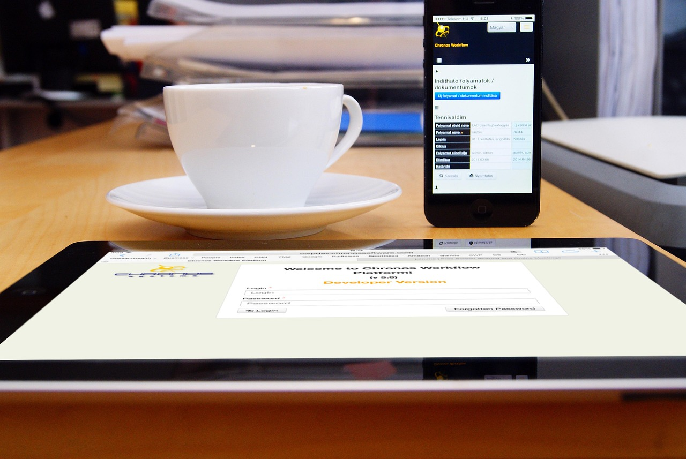

# Manual de Usuario - TechSolutions

Fecha: 3 de octubre de 2025

Este manual cubre las funcionalidades del sitio TechSolutions. Para cada funcionalidad encontrarás una breve descripción, pasos de uso y una imagen de referencia tomada de los recursos del proyecto.

> Nota: para ver las imágenes correctamente, sirve la carpeta del proyecto desde un servidor estático (por ejemplo `python -m http.server`) y abre la página correspondiente en el navegador.

---

## Índice de funcionalidades (24)

1. Carga dinámica del Header
2. Carga dinámica del Footer
3. Navegación principal (Navbar)
4. Activado del enlace actual en la navegación
5. Menú móvil (colapsable)
6. Página de Servicios (lista)
7. Tarjeta de Servicio (vista previa)
8. Página de Detalle de Servicio
9. Breadcrumb en detalle de servicio
10. Servicios relacionados (sugerencias)
11. Contratar servicio (modal)
12. Envío de solicitud de contratación (guardado local)
13. Notificaciones en pantalla
14. Spinner / Estado de carga global
15. Animaciones por scroll (IntersectionObserver)
16. Observación de elementos dinámicos
17. Gestión de datos de servicios (localStorage)
18. Panel Admin: vista de tabla de servicios
19. Panel Admin: crear servicio
20. Panel Admin: editar servicio
21. Panel Admin: eliminar / desactivar servicio
22. Vista previa de imagen en Admin (FileReader)
23. Autenticación demo (login client-side)
24. Bloqueo por demasiados intentos y recordar sesión

---

## 1. Carga dinámica del Header

Descripción:
El header (barra de navegación) se carga desde `templates/header.html` y se inserta en el DOM al inicio (por `TechSolutionsApp.loadTemplate`). Esto permite mantener un header común entre páginas.

Cómo usar:
- Asegúrate de que cada página tenga el contenedor `<div id="header-container"></div>`.
- Al abrir la página, el header se carga automáticamente.

Imagen de referencia:


---

## 2. Carga dinámica del Footer

Descripción:
El footer se carga desde `templates/footer.html` y se inserta en el contenedor designado. Permite actualizaciones centrales del pie de página.

Cómo usar:
- Incluye `<div id="footer-container"></div>` en tus páginas.
- `TechSolutionsApp.updateFooterYear()` puede actualizar el año si el footer usa la clase `current-year`.

Imagen de referencia:


---

## 3. Navegación principal (Navbar)

Descripción:
Barra de navegación responsive con enlaces a Inicio, Servicios, Contacto y Login.

Cómo usar:
- Haz clic en "Servicios" para acceder a la lista de servicios.
- En móvil, usa el botón toggler para abrir/cerrar el menú.

Imagen de referencia:


---

## 4. Activado del enlace actual en la navegación

Descripción:
`TechSolutionsApp.activateCurrentLink()` marca con la clase `active` el enlace correspondiente a la página actual.

Cómo usar:
- Navega a cualquier página y el enlace relevante se resaltará automáticamente.

Imagen de referencia:


---

## 5. Menú móvil (colapsable)

Descripción:
El menú se colapsa en pantallas pequeñas; al hacer clic en un enlace se cierra automáticamente para mejorar la experiencia móvil.

Cómo usar:
- Abre la página en un móvil o reduce el ancho del navegador. Pulsa el icono del menú y selecciona una opción.

Imagen de referencia:


---

## 6. Página de Servicios (lista)

Descripción:
Página `servicios.html` que renderiza todas las tarjetas de servicios activos consultando `servicesManager.getAllActiveServices()`.

Cómo usar:
- Abre `servicios.html` desde el servidor local.
- Desplázate para ver los servicios.

Imagen de referencia:


---

## 7. Tarjeta de Servicio (vista previa)

Descripción:
Cada servicio se muestra como una tarjeta con imagen, nombre, precio y botón para ver detalles.

Cómo usar:
- En la lista de servicios, usa el botón "Ver Detalles" para acceder a la página individual del servicio.

Imagen de referencia:


---

## 8. Página de Detalle de Servicio

Descripción:
`detalles-servicio.html?id={id}` muestra la imagen grande del servicio, precio, características y descripción extensa.

Cómo usar:
- Desde una tarjeta, haz clic en "Ver Detalles". La página carga la información según el parámetro `id` en la URL.

Imagen de referencia:


---

## 9. Breadcrumb en detalle de servicio

Descripción:
La página de detalle actualiza el breadcrumb (elemento con id `breadcrumb-service`) con el nombre del servicio.

Cómo usar:
- Abrir `detalles-servicio.html?id=1` y observar el breadcrumb que cambia al nombre del servicio.

Imagen de referencia:


---

## 10. Servicios relacionados (sugerencias)

Descripción:
En la página de detalle se muestran hasta 3 servicios relacionados (otros servicios activos distintos al actual) cargados dinámicamente.

Cómo usar:
- Abre un detalle y mira la sección "Otros Servicios que te Podrían Interesar".

Imagen de referencia:


---

## 11. Contratar servicio (modal)

Descripción:
Botón "Contratar Servicio" abre un modal Bootstrap con formulario de contacto para solicitar la contratación.

Cómo usar:
- En la página de detalle, pulsa "Contratar Servicio". Rellena el formulario y pulsa "Enviar Solicitud".

Imagen de referencia:


---

## 12. Envío de solicitud de contratación (guardado local)

Descripción:
Las solicitudes se guardan en `localStorage` bajo la clave `service_contracts` en formato JSON. Se muestra una notificación de confirmación.

Cómo usar:
- Completa y envía el formulario de contratación. Revisa `localStorage` para ver el objeto guardado.

Imagen de referencia:


---

## 13. Notificaciones en pantalla

Descripción:
`TechSolutionsApp.showNotification(message,type,duration)` muestra notificaciones visuales (info, success, warning, error) en la esquina superior derecha.

Cómo usar:
- Varias acciones (por ejemplo enviar contrato, guardar servicio) disparan notificaciones automáticas.

Imagen de referencia:


---

## 14. Spinner / Estado de carga global

Descripción:
`showLoading()` y `hideLoading()` muestran y ocultan un spinner global para operaciones que requieren espera.

Cómo usar:
- El spinner se usa internamente al simular el flujo de login y en zonas donde se cargan datos dinámicos.

Imagen de referencia:


---

## 15. Animaciones por scroll (IntersectionObserver)

Descripción:
Elementos con clases `.servicio-item, .card, .hero-text` se animan al entrar en la ventana (clase `animate-in`).

Cómo usar:
- Abre `servicios.html` y desplázate; las tarjetas se animarán en su entrada.

Imagen de referencia:


---

## 16. Observación de elementos dinámicos

Descripción:
`TechSolutionsApp.observeElements(root)` permite registrar elementos insertados dinámicamente (por ejemplo cuando se renderizan servicios o related cards) para que sean observados por el IntersectionObserver.

Cómo usar:
- Tras inyectar HTML dinámico, el renderer llama a `observeElements(container)` automáticamente.

Imagen de referencia:



---

## 17. Gestión de datos de servicios (localStorage)

Descripción:
`ServicesDataManager` gestiona la persistencia de servicios en `localStorage` (`techsolutions_services`), con métodos CRUD.

Cómo usar:
- Las modificaciones via Admin o inicialización del proyecto actualizan `localStorage` automáticamente.

Imagen de referencia:


---

## 18. Panel Admin: vista de tabla de servicios

Descripción:
`admin.html` contiene una tabla que muestra todos los servicios (activos/inactivos) permitiendo acciones rápidas de edición, activación y eliminación.

Cómo usar:
- Accede a `admin.html` (requiere login demo si se ha implementado redirección) y revisa la tabla.

Imagen de referencia:


---

## 19. Panel Admin: crear servicio

Descripción:
Desde el modal de creación puedes añadir un nuevo servicio (nombre, precio, descripción, imagen). El servicio se añade en `localStorage` y aparece en la tabla.

Cómo usar:
- Abrir "Agregar nuevo servicio" en admin, rellenar campos y guardar.

Imagen de referencia:


---

## 20. Panel Admin: editar servicio

Descripción:
Editar abre el modal con los valores actuales; al guardar se actualiza el servicio en `localStorage`.

Cómo usar:
- En la fila del servicio, pulsa el botón de editar, modifica campos y guarda.

Imagen de referencia:


---

## 21. Panel Admin: eliminar / desactivar servicio

Descripción:
- "Desactivar" marca el servicio como `active: false` (lo oculta en la lista pública).
- "Eliminar permanentemente" lo borra del array y de `localStorage`.

Cómo usar:
- Usa los botones en la fila correspondiente en la tabla de admin.

Imagen de referencia:


---

## 22. Vista previa de imagen en Admin (FileReader)

Descripción:
Al seleccionar una imagen en el formulario del admin, se muestra una vista previa antes de guardar la entidad.

Cómo usar:
- En el modal de servicio, selecciona un archivo en el input de imagen; la vista previa aparecerá en `#imagePreview`.

Imagen de referencia:


---

## 23. Autenticación demo (login client-side)

Descripción:
Login de ejemplo con credenciales definidas en `auth.js` (solo demo). Soporta recordar sesión y redirección a `admin.html`.

Credenciales demo (para pruebas):
- admin: `admin` / `admin123`
- usuario: `usuario` / `user123`

Cómo usar:
- Abrir `login.html`, introducir credenciales y entrar. Si activas "recordar", la sesión se guarda en `localStorage`.

Imagen de referencia:


---

## 24. Bloqueo por demasiados intentos y recordar sesión

Descripción:
Tras 3 intentos fallidos el sistema bloquea el login por 5 minutos (guardado en `localStorage` con `lockoutTime`). Si se recuerda la sesión, la duración aumenta.

Cómo usar:
- Simula intentos fallidos y observa el mensaje de bloqueo. Usa los métodos de `authDebug` para limpiar en desarrollo.

Imagen de referencia:


---

## Ver el manual y las imágenes localmente

1. Abre una terminal (PowerShell) en la carpeta del proyecto.

```powershell
python -m http.server 8000
```

2. Abre en el navegador `http://localhost:8000/USER_MANUAL.md` o `http://localhost:8000/` y navega a las páginas (`servicios.html`, `admin.html`, `login.html`).

---

## Notas finales

- Muchas acciones (contrataciones, servicios creados, sesiones) se guardan en `localStorage`; para restaurar el estado inicial puedes borrar las claves `techsolutions_services`, `service_contracts`, `userSession`, `loginAttempts` y `lockoutTime` desde las herramientas de desarrollador.
- Si quieres que extraiga capturas reales (screenshots) desde el proyecto para sustituir las imágenes de ejemplo por capturas exactas, puedo generarlas si me das permiso para ejecutar un navegador sin cabeza en tu entorno o me indicas cómo prefieres hacerlo.

Si quieres que convierta este manual a HTML o PDF, o que lo añada a `docs/` y lo vincule desde `README.md`, indícalo y lo hago.